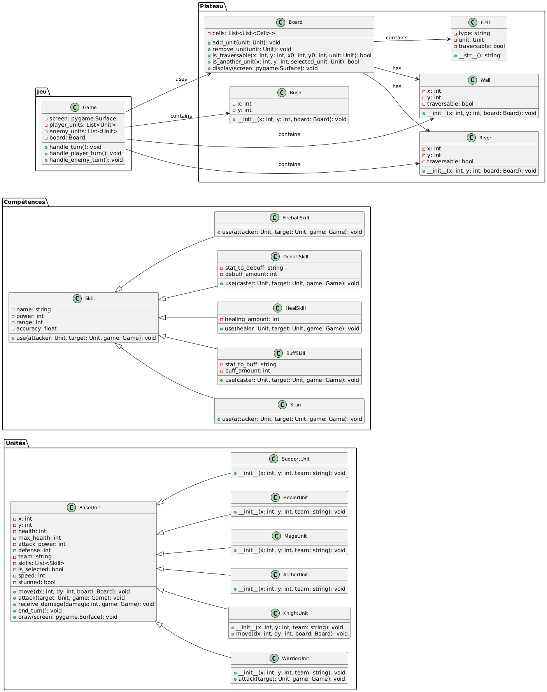

# Jeu de stratégie 2D - "Fakaiwi"

Un jeu de stratégie en 2D basé sur un plateau, où les joueurs contrôlent différentes unités possédant des compétences uniques, évoluant dans un environnement dynamique avec des obstacles variés. Ce projet est développé en Python avec la bibliothèque Pygame pour la gestion graphique.

## Table des Matières
- [Contributeurs](#contributeurs)
- [Aperçu du Jeu](#aperçu-du-jeu)
- [Fonctionnalités](#fonctionnalités)
- [Installation et Lancement](#installation-et-lancement)
- [Gameplay](#gameplay)
- [Architecture du Code](#architecture-du-code)
- [Justification des choix de conception](#justification-des-choix-de-conception)
- [Contribuer](#contribuer)

## Contributeurs
Étudiants de Sorbonne Université Sciences dans le cadre d'un projet pédagogique dans l'unité d'enseignement de Programmation Orientée Objet en Python.
Master 1 - Ingénierie pour la Santé, Systèmes Mécatroniques pour la Réhabilitation (M1-IPS SMR).

### Liste des contributeurs :
- **GUERRERO ESCOBAR Fabian**: fabian.guerrero_escobar@sorbonne-universite.fr
- **LIU Kaiyu**: kaiyu.liu@sorbonne-universite.fr
- **WU William**: william.wu@sorbonne-universite.fr

### Encadrants universitaires :
- Louis ANNABI: louis.annabi@sorbonne-universite.fr
- Ramy ISKANDER: ramy.iskander@sorbonne-universite.fr

## Aperçu du Jeu
Capture d'écran ou GIF animé montrant le jeu en action (à ajouter).

## Fonctionnalités
- **Modes de jeu** :
  - **PVE** : Joueur contre Jeu aléatoire (Intelligence artificielle randomisée).
  - **PVP** : Joueur contre Joueur.
- **Tour par tour** : Le jeu se déroule en alternant les actions des joueurs et des ennemis.
- **Système de compétences** :
  - Attaques de mêlée, à distance ou en zone.
  - Compétences de soin, de buff et de debuff.
- **Obstacles dynamiques** :
  - Murs : non traversables.
  - Rivières : traversables uniquement par certains types d'unités.
  - Buissons : traversables mais stratégiques (on peut s'y cacher).
- **Interface utilisateur intuitive** :
  - Indicateurs visuels pour les déplacements, attaques et compétences.
  - Barre de santé visible pour chaque unité.

## Installation et Lancement
### Prérequis
Assurez-vous d'avoir Python 3.8 ou une version ultérieure installé ainsi que la bibliothèque Pygame.

```bash
pip install pygame
```

### Lancer le Jeu
Exécutez le fichier `main.py` :

```bash
python main.py
```

## Gameplay
Le jeu se déroule sur un plateau de 12x20 cases avec différentes unités et obstacles.

### Commandes :
- **Déplacement** : Utilisez les touches fléchées pour déplacer une unité sélectionnée.
- **Choix des compétences** : Utilisez la souris lorsque le menu de choix de compétences apparaît.
- **Validation** : Appuyez sur `Espace` pour valider un déplacement ou valider une compétence.
- **Navigation dans les menus** : Utilisez les flèches haut et bas pour naviguer et `Espace` pour sélectionner.

### Objectifs :
- **PVE** : Éliminez toutes les unités ennemies pour remporter la victoire.
- **PVP** : Contrôlez vos unités et battez l'adversaire.

## Architecture du Code
Le code est structuré en plusieurs modules pour garantir la lisibilité et la modularité.

- **`main.py`** : Point d'entrée du jeu.
- **`game.py`** : Logique principale du jeu (gestion des tours, conditions de victoire/défaite).
- **`board.py`** : Gère le plateau, ses cellules et les interactions entre unités.
- **`cell.py`** : Représente une cellule avec ses propriétés (traversable, type, unité présente).
- **`unit.py`** : Définit les unités et leurs actions (déplacement, attaque, compétences).
- **`skill.py`** : Implémente les différentes compétences (attaque, soin, buff, debuff).
- **`wall.py`, `river.py`, `bush.py`** : Modules pour la génération et l'affichage des obstacles.
- **`startpage.py`, `winscreen.py`** : Interfaces graphiques pour les écrans de démarrage et de fin de jeu.

### Diagramme UML

Voici le diagramme UML du projet pour visualiser les relations entre les classes :



## Justification des choix de conception

Le diagramme UML a été conçu en respectant une approche modulaire et orientée objet pour garantir la flexibilité et l'extensibilité du jeu.

1. **Classes principales** :
   - **Game** : Gère la logique centrale, le cycle de jeu et les interactions entre les différentes entités (unités, obstacles, etc.).
   - **Board** : Représente le plateau du jeu avec une grille de cellules, facilitant la gestion des positions et des types de cellules.
   - **Cell** : Chaque cellule a des attributs (type, traversabilité, unité) pour définir ses fonctionnalités.

2. **Unités** :
   - La classe **BaseUnit** est la classe mère des unités. Elle gère les attributs communs comme la santé, l'attaque, la défense et les compétences.
   - Les sous-classes comme **WarriorUnit**, **KnightUnit** ou **MageUnit** permettent de spécialiser les comportements des unités (compétences et actions).

3. **Compétences** :
   - La classe **Skill** représente les compétences de base (attaques, soin, buff, etc.).
   - Les sous-classes comme **HealSkill**, **FireballSkill** ou **DebuffSkill** introduisent des comportements spécifiques avec des attributs supplémentaires.

4. **Obstacles** :
   - Les classes **Wall**, **River** et **Bush** modélisent différents types d'obstacles avec des propriétés variées (traversables ou non).

5. **Relations** :
   - Les associations entre classes (par exemple, **Game** utilise **Board**, **Board** contient **Cell**) sont clairement définies pour assurer une interaction cohérente entre les différentes entités.

Ce choix de conception permet une évolutivité simple. Par exemple, l'ajout d'une nouvelle unité ou compétence ne nécessite qu'une extension des classes existantes sans réécrire la logique principale.

